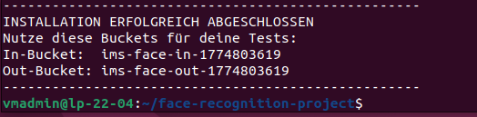
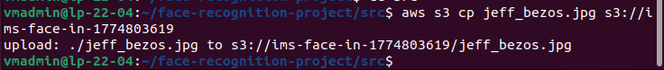
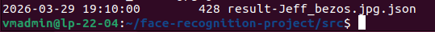
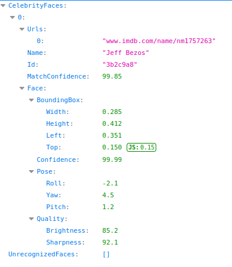

# multiple_persoenlichkeiten (M346 Projekt-Repository)

Dieses Projekt implementiert einen serverlosen Dienst zur Gesichtserkennung (Celebrity Recognition) mit AWS Lambda, Amazon S3 und AWS Rekognition. Sobald ein Bild hochgeladen wird, analysiert der Service das Bild vollautomatisch auf bekannte Persönlichkeiten und speichert das Ergebnis als JSON ab.

## 1. Aufbau des Services

Der Service besteht aus mehreren AWS-Komponenten, die automatisiert bereitgestellt werden und nahtlos zusammenarbeiten.

### 1.1 Architekturdiagramm

Das folgende Diagramm veranschaulicht den Datenfluss und das Zusammenspiel der AWS-Dienste von dem Upload des Bildes bis hin zum Bereitstellen des Ergebnisses:

```mermaid
graph TD
    User(["Anwender/in"]) -->|1. Lädt Bild (.jpg/.png) hoch| S3In[("S3 In-Bucket")]
    S3In -->|2. Event: S3 ObjectCreated| Lambda["AWS Lambda (FaceRecognitionHandler)"]
    Lambda <-->|3. Ruft Bild ab & sendet zur Image-Analyse| Rekog{"AWS Rekognition"}
    Lambda -->|4. Speichert Ergebnis im JSON-Format| S3Out[("S3 Out-Bucket")]
    S3Out -->|5. Lädt das Erkennungsergebnis herunter| User
```

*Legende zum Diagramm:* 
Der Anwender lädt ein Bild in den Eingangsspeicher (S3 In-Bucket). Dieses Event triggert automatisch die AWS Lambda-Funktion, die dann das Bild zur Gesichtserkennung an AWS Rekognition weiterleitet. Das Analyseergebnis der Prominenten-Erkennung speichert die Lambda-Funktion anschliessend im Ausgabespeicher (S3 Out-Bucket), woraufhin der Benutzer die fertige JSON-Datei abholen kann.

### 1.2 Komponentenübersicht

Die folgende Tabelle listet die verwendeten AWS-Dienste und deren spezifische Funktionen innerhalb des Projekts auf, um einen schnellen Überblick zu gewähren:

| Komponente | Verwendeter AWS Service | Funktion im Projekt |
| :--- | :--- | :--- |
| **S3 In-Bucket** | Amazon S3 | Dient als **Eingangsspeicher**. Nimmt hochgeladene Bilder entgegen und löst das Trigger-Event für die Verarbeitung aus. |
| **FaceRecognitionHandler** | AWS Lambda | Das **Herzstück** (`src/lambda_function.py`). Verarbeitet das S3-Trigger-Event, führt die Logik aus und steuert die Bildanalyse. |
| **Bildanalyse** | AWS Rekognition | Führt die **Celebrity Recognition** aus, also die KI-gestützte Erkennung der Gesichter im übergebenen Bild. |
| **S3 Out-Bucket** | Amazon S3 | Dient als **Ausgabespeicher**. Legt das finale JSON-Dokument (`result-[Dateiname].json`) mit den Treffern ab. |

## 2. Inbetriebnahme (Setup)

Die Bereitstellung der Infrastruktur erfolgt komplett automatisiert über das mitgelieferte Bash-Skript `init.sh`.

**Allgemeine Voraussetzungen:**
* Installierte und authentifizierte [AWS CLI](https://aws.amazon.com/cli/).
* Eine existierende IAM LabRole (in diesem Fall konfiguriert als `arn:aws:iam::490789669163:role/LabRole`).

**Durchführung:**
1. Navigieren Sie in das Projektverzeichnis.
2. Führen Sie das Setup-Skript aus:
   ```bash
   bash src/init.sh
   ```
3. Das Skript übernimmt alle Aufgaben für das Deployment:
   * Erstellung von S3 In- und Out-Buckets in der Region `us-east-1` (soweit nicht schon vorhanden).
   * Generierung einer `.zip`-Datei für den Code.
   * Erstellung der AWS Lambda-Funktion (`FaceRecognitionHandler`).
   * Zuweisung aller nötigen Berechtigungen (S3-Aufruf-Rechte für Lambda).
   * Konfigurieren der Event Notification (S3-Trigger) vom In-Bucket zur Lambda-Funktion.

Am Ende der erfolgreichen Ausführung gibt das Skript die dynamisch generierten Namen der beiden S3-Buckets in der Konsole aus. Notieren Sie sich diese.

## 3. Verwendung

1. **Bild hochladen**: Legen Sie ein Bild in den generierten **In-Bucket**. Das können Sie beispielsweise über die AWS Management Console tun oder via CLI:
   ```bash
   aws s3 cp mein_bild.jpg s3://[NAME_DES_IN_BUCKETS]/
   ```
2. **Bildanalyse abwarten**: Das Hochladen löst im Hintergrund die Lambda-Funktion aus, welche mit AWS Rekognition die Identifikation durchführt.
3. **Ergebnis abrufen**: Im **Out-Bucket** wird nach wenigen Sekunden eine JSON-Datei mit dem Präfix `result-` erstellt. Diese enthält die erkannten Celebrities sowie die zugehörigen Trefferwahrscheinlichkeiten:
   ```bash
   aws s3 cp s3://[NAME_DES_OUT_BUCKETS]/result-mein_bild.jpg.json .
   ```

## 4. Testdokumentation

Diese Sektion beinhaltet das offizielle Testprotokoll zur Überprüfung der AWS Face Recognition Pipeline.

### Testfall 1 & 4: Installation und erfolgreiche Erkennung (Positiv-Test)

In diesem kombinierten Testlauf wird die korrekte Ausführung des Setup-Skripts geprüft, gefolgt vom Upload eines Bildes (Jeff Bezos). Anschliessend wird verifiziert, ob die Rekognition-Lambda-Funktion eine korrekte JSON-Ausgabe im Out-Bucket erzeugt.

**Allgemeine Angaben:**
* **Testzeitpunkt:** 29.03.2026, ca. 19:10 Uhr
* **Testperson:** Vincent Haucke
* **Spezifische Informationen:** Das Setup und der Upload wurden über das Linux-Terminal (AWS CLI) durchgeführt. Testbild: `jeff_bezos.jpg`.

**Durchführung & Ergebnisse:**

1. **Infrastruktur-Bereitstellung (`init.sh`)**
   Das Installationsskript wurde ausgeführt und hat fehlerfrei abgeschlossen. Die Buckets `ims-face-in-1774803619` und `ims-face-out-1774803619` wurden erfolgreich erstellt.
   

2. **Upload in den IN-Bucket**
   Das Bild `jeff_bezos.jpg` wurde mittels AWS CLI in den generierten In-Bucket kopiert.
   

3. **Kontrolle des OUT-Buckets**
   Nach wenigen Sekunden befand sich die generierte Resultat-Datei `result-Jeff_bezos.jpg.json` im Out-Bucket.
   

4. **Kontrolle der Ausgabe (JSON-Inhalt)**
   Ein Blick in die formatierte JSON-Datei bestätigt, dass AWS Rekognition die Person "Jeff Bezos" richtig identifiziert hat.
   

**Fazit & Massnahmen:**
* **Fazit:** Beide Testfälle (Setup und Positiv-Test) waren **erfolgreich**. Die Infrastruktur greift nahtlos ineinander. Der Upload eines Bildes via Command Line triggert die Lambda-Funktion problemlos. Amazon Rekognition erkennt *Jeff Bezos* zuverlässig mit einer Confidence von 99.85%.
* **Massnahmen/Empfehlungen:** Die Grundfunktionalität der Pipeline ist bestätigt. Wie im Konzept vorgesehen funktioniert sowohl das automatisierte Setup als auch die eigentliche Applikation fehlerfrei. Keine zwingenden Anpassungen an der Architektur nötig.
